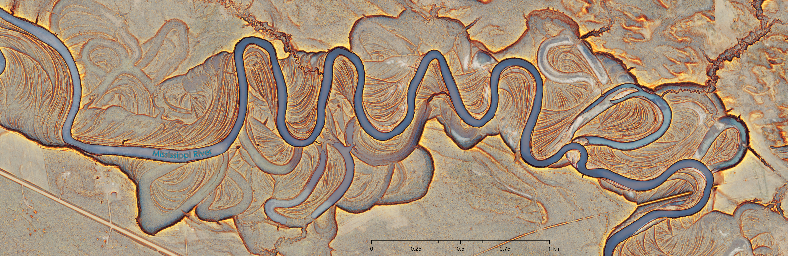

# Red Relief Image Map (RRIM) Toolbox for ArcGIS Pro  
### High‑Performance, Tiled Terrain Visualization Tools for Massive DEMs

## Overview

The **RRIM Toolbox** is a fully ArcGIS‑native, high‑performance terrain visualization suite engineered for **massive LiDAR‑derived DEMs**, including **multi‑GB**, and **BIGTIFF** datasets.

All computational modules implement an end-to-end **tiled streaming architecture (2048 × 2048 blocks)** with sub-tile window buffering, SIMD vectorization, and fast GDAL I/O. This eliminates out-of-memory crashes, allowing stable, low-overhead execution on rasters exceeding **(15 GB)** while keeping RAM strictly constrained.

The toolbox provides four core processing modules:

1. **Topographic Openness Index** (Single-step zenith/nadir calculation with boundary smoothing)  
2. **Slope from DEM** (Optimized Horn algorithm with seam-safe boundaries)  
3. **Red Relief Image Map (Custom)** (Cividis openness + red chromatic slope overlay)  
4. **Red Relief Image Map (Classic)** (High-contrast grayscale openness + red slope overlay)  

---

### Dependency‑Free Architecture
Runs natively within ArcGIS Pro’s default Python environment.  
No separate virtual environments, external wheels, or custom C-compilers required:

- ArcGIS Pro 3.x Python environment (`arcpy`)  
- NumPy (bundled with ArcGIS Pro)  
- GDAL / OGR (bundled with ArcGIS Pro)  

---

# Key Architectural Highlights

### 1. Unified Tiling & Windowed Streaming
- Single-raster processing streams in **2048 × 2048 pixel blocks**.
- Neighbor-dependent filters (Openness search radius, Slope 3×3 kernels) automatically apply a **padded halo** around each tile, compute the algorithm, and write only the valid interior block.
- Eliminates tile seams, edge truncation, and memory allocation crashes on massive datasets.

### 2. High-Speed SIMD Vectorized Openness Engine
- Openness calculation utilizes an in-place pre-padded reflection window with direct array vectorization.
- Retains smooth edge transitions along irregular footprints and valid terrain borders via single-pass post-index boundary smoothing (`_overwrite_boundary_from_realmask`).

### 3. Balanced Multithreading & Drive-Safe Batching
- Folder batch mode processes rasters in discrete, organized groups to maximize CPU utilization while strictly preventing thread starvation, RAM bloat, and disk thrashing:
  - **Openness:** Processes batches of 8 with up to **8 concurrent workers** for high-throughput math.
  - **Slope:** Batches of 4 locked to **max 2 workers** to prevent disk queue saturation on I/O-heavy operations.
  - **RRIM & RRIM Classic:** Batches of 8 locked to **max 2 workers** to accommodate dual-raster reads and 3-band writes without memory spikes.
- Safe for fast local NVMe SSDs, external USB HDDs, and network storage shares alike.

### 4. True 3-Band RGB GeoTIFFs with Zero-Artifact Footprints
- Generates standard, highly compatible **3-band 8-bit unsigned (GDT_Byte) GeoTIFFs**.
- Transparent footprint masking: regardless of user-defined input/output NoData parameters, background and non-terrain pixels are stored with an internal display value of `0` across all three bands.
- Eliminates black collars, and white fringing.

### 5. Persistent Native Display Metadata (.aux.xml)
- Every generated RRIM GeoTIFF automatically writes a clean, exact GDAL PAM auxiliary sidecar (`<basename>.tif.aux.xml`):

    <PAMDataset>
      <Metadata>
        <MDI key="DataType">Processed</MDI>
      </Metadata>
    </PAMDataset>

- Guarantees that when loaded into **any ArcGIS Pro map or project**, Pro honors the pre-rendered RGB stretch immediately (`StretchType = None`) without applying an unwanted 2% contrast stretch or blue/gray color casts.

### 6. Non-Destructive File & Directory Protection
- All destination folder parameters are explicitly configured to prevent ArcGIS Pro from auto-purging target directories on overwrite.
- Cleanup routines target only the specific destination raster and its exact sidecars (`.tif`, `.tif.aux.xml`, `.tif.ovr`, `.tif.msk`, `.tif.xml`), ensuring adjacent rasters and independent runs in the same folder are never deleted.

### 7. Real-Time Telemetry & Adaptive Duration Formatting
- Provides comprehensive progress feedback in the geoprocessing pane: completed tile counts, remaining queue counts, moving-average execution times, and overall elapsed time.
- Durations adapt dynamically: operations under 60 seconds display in precise seconds (e.g., `18.42s`), while longer operations report in minutes and seconds (e.g., `7m 35.4s`).

---

# 1. Topographic Openness Index

Computes zenith and nadir horizon scanning angles across multiple radial directions, outputting the normalized **Topographic Openness Index** in a single pass:
$$\text{Openness Index} = \frac{\text{POS} - \text{NEG}}{2}$$

### Features
- **Tiled Streaming for Input DEM(s)**: Processes tiles in 2048 × 2048 blocks with an expanded halo equal to the search radius. Seams and edge truncation are eliminated.
- **Fast SIMD Folder Batching**: Multi-threaded execution across individual files in chunks of 8 with up to 8 concurrent workers.
- **Boundary Smoothing**: Weighted inverse-distance neighborhood smoothing along outer real-elevation boundaries removes raster collar artifacts.
- **Low Memory Footprint**: Keeps RAM usage stable (~400 MB to 1 GB per active tile), preventing memory lockups on large datasets.

### Parameters
| Parameter | Direction | Type | Description |
|---|---|---|---|
| **Input DEM(s)** | Input | Raster Layer (Multi) | One or more DEMs processed using tiled block streaming. |
| **Input Folder (optional)** | Input | Folder | Directory of DEM tiles processed in multi-threaded batch mode. |
| **Search Radius (pixels)** | Input | Long | Search radius in cells (default: `100`). |
| **Number of Directions** | Input | String (`8`, `16`) | Radial directional steps (default: `8`). |
| **Output Folder** | Input | Folder | Directory where output GeoTIFFs are written. |
| **Output NoData value** | Input | Double | Custom NoData value (default: `-9999.0`). |
| **Debug Mode** | Input | Boolean | Detailed execution step timing logs. |

---

# 2. Slope from DEM

Computes surface slope in degrees using an optimized, boundary-safe 3×3 Horn kernel.

### Features
- **Seam-Safe Window**: Tile boundaries overlap to preserve mathematical continuity across tile edges.
- **Protected Concurrency**: Batch mode processes in chunks of 4 with workers locked to **2**, preventing drive queue saturation on high-throughput disk writes.
- **Single or Batch Mode**: Streams single large rasters via tiled blocks or processes directories via batch queues.

### Parameters
| Parameter | Direction | Type | Description |
|---|---|---|---|
| **Input DEM(s)** | Input | Raster Layer (Multi) | One or more DEMs processed via tiled streaming. |
| **Input Folder (optional)** | Input | Folder | Directory of DEM tiles for batch conversion. |
| **Output Folder** | Input | Folder | Destination directory for `<base>_slope.tif`. |
| **Output NoData value** | Input | Double | Default: `-9999.0`. |

---

# 3. Red Relief Image Map (Custom)

Blends slope gradient and topographic openness using the perceptually uniform **Cividis** color ramp and a red-tinted chromatic slope overlay.

$$\text{RGB} = (1.0 - \alpha) \cdot \text{Cividis}(\text{Openness}) + \alpha \cdot \text{Reds}(\text{Slope})$$
*(where $\alpha = 0.7$)*

### Features
- **Dynamic Sampling**: Samples representative terrain values across datasets to establish robust normalization thresholds ($\mu \pm 3.5\sigma$ for openness; $\mu \pm 4.0\sigma$ for slope) without reading entire rasters into RAM.
- **Perceptual Contrast**: Maximizes structural visibility across both deep valleys and sharp ridges without directional illumination bias.
- **Instant ArcGIS Pro Display**: Writes 3-band Byte GeoTIFFs with `.aux.xml` metadata for immediate, true-color rendering without manual symbology adjustment.

---

# 4. Red Relief Image Map (Classic)

Traditional RRIM formulation blending a high-contrast grayscale openness base with a red slope overlay.

### Features
- **Accurate Relief Perception**: Correctly oriented grayscale mapping ensures convex features (ridges) appear light and concave features (valleys/drainages) appear dark, preventing inverted optical illusions.
- **Percentile Normalization**: Normalizes slope and openness between the 0.5% and 99.5% percentiles derived from spatial multi-grid sampling.
- **Independent Architecture**: Fully decoupled processing logic for standalone stability and maintenance.

---

# Module Comparison: Custom vs. Classic RRIM

| Feature | Custom RRIM | Classic RRIM |
|---|---|---|
| **Openness Base Ramp** | Cividis (Perceptual Yellow–Blue) | Grayscale (Black–White) |
| **Slope Overlay** | Red chromatic scale ($\alpha = 0.7$) | Red chromatic scale ($\alpha = 0.7$) |
| **Normalization Method** | $\mu \pm 3.5\sigma$ / $\mu \pm 4.0\sigma$ (Sampled) | $0.5\% \text{ to } 99.5\%$ Percentiles (Sampled) |
| **Visual Appearance** | Smooth, rich structural separation | High-contrast, traditional archaeological style |
| **Best Used For** | Geomorphology, hydrology, fault mapping | Archaeology, cultural resources, microtopography |
| **Output Format** | 3-band 8-bit RGB GeoTIFF (BigTIFF) | 3-band 8-bit RGB GeoTIFF (BigTIFF) |

---

# Processing & Concurrency Matrix

| Tool | Single-Raster Mode | Folder Mode | Tile Size | Worker Threads | Output Format |
|---|---|---|---|---|---|
| **Openness** | Tiled Block Streaming | Full-Array (Batch of 8) | 2048 × 2048 | Max 8 | 32-bit Float GeoTIFF |
| **Slope** | Tiled Block Streaming | Full-Array (Batch of 4) | 2048 × 2048 | Max 2 | 32-bit Float GeoTIFF |
| **RRIM Custom** | Tiled Block Streaming | Full-Array (Batch of 8) | 2048 × 2048 | Max 2 | 3-band 8-bit RGB GeoTIFF |
| **RRIM Classic** | Tiled Block Streaming | Full-Array (Batch of 8) | 2048 × 2048 | Max 2 | 3-band 8-bit RGB GeoTIFF |

---

# Installation & Workflow

1. Download or clone this repository to your local drive.
2. In ArcGIS Pro, open the **Catalog Pane**.
3. Expand **Toolboxes**, right-click, and select **Add Toolbox**.
4. Browse to and select `RRIM_Toolbox.pyt`.
5. Execute the tools in sequence:
   - **Step 1**: Run **Topographic Openness Index** on your elevation data.
   - **Step 2**: Run **Slope from DEM** on your elevation data.
   - **Step 3**: Run **Red Relief Image Map (Custom or Classic)** by pointing to the generated slope and openness folders.

> **Production Tip:** When processing large tiled DEM collections, buffer each raw DEM tile by **100 pixels** (matching the default openness radius) prior to processing. After running the pipeline, clip the final outputs back to their original footprints to achieve seamless, edge-to-edge mosaics across massive project areas.

---

# System Requirements

- **Operating System**: Windows 10 / 11 / Server 2019+
- **Host Application**: ArcGIS Pro 3.0 or later
- **Python Runtime**: Default ArcGIS Pro Python environment (`arcgispro-py3`, Python 3.9+)
- **Storage**: Compatible with internal NVMe SSDs, external USB HDDs, and network storage shares (UNC paths).

---

# Citation & Acknowledgements

The algorithmic foundations of topographic openness and azimuth-invariant visualization originate from the research published by the **Relief Visualization Toolbox (RVT)** team and pioneering geomorphologists:

- **Yokoyama, R., Shirasawa, M., Pike, R. J.** (2002). *Visualizing topography by openness: A new approach to three-dimensional representations of terrain.* Photogrammetric Engineering and Remote Sensing, 68(3), 257–266.
- **Chiba, T., Kaneta, S., Azuma, T.** (2008). *Red Relief Image Map: New technique for visualizing fine topography.* The International Archives of the Photogrammetry, Remote Sensing and Spatial Information Sciences.
- **Kokalj, Ž., Somrak, M.** (2019). *Why Not a Single Image? Combining Multiple LiDAR Visualisations to Optimize Information Content on Historical Landscape Features.* Journal of Archaeological Science: Reports.

*Note: This toolbox is an independent, native Python/ArcPy implementation optimized for high-performance GIS production pipelines.*

---

# Author

**Darren J. Thornbrugh**  
USDA Forest Service  
Spatial Analysis, Remote Sensing & Ecological Modeling  

---

# Visual Examples

  

*High‑contrast, perceptually uniform RRIM visualization capturing braided river architecture, microtopographic bar sequences, and steep bluff margins without directional shadow bias.*